# KalviCore - Complete Screen Documentation

**Product:** KalviCore - Complete Campus. One Intelligent System.  
**Built by:** AutoMystics  
**Affiliated to:** Madurai Kamaraj University  
**Region:** Tamil Nadu, India  
**Version:** 1.0  
**Date:** April 16, 2026  

---

## Table of Contents

1. [Login Page](#1-login-page)
2. [Dashboard](#2-dashboard)
3. [Departments](#3-departments)
4. [Students](#4-students)
5. [Staff](#5-staff)
6. [Courses](#6-courses)
7. [Subjects](#7-subjects)
8. [Attendance](#8-attendance)
9. [Fees & Payments](#9-fees--payments)
10. [Examinations](#10-examinations)
11. [Hostel Management](#11-hostel-management)
12. [Transport Management](#12-transport-management)
13. [Library Management](#13-library-management)
14. [Events & Cultural](#14-events--cultural)
15. [Communications](#15-communications)
16. [Inventory & Assets](#16-inventory--assets)
17. [Timetable](#17-timetable)
18. [Assignments](#18-assignments)
19. [Certificates](#19-certificates)
20. [Staff Leaves](#20-staff-leaves)
21. [Settings & Configuration](#21-settings--configuration)
22. [User Management](#22-user-management)
23. [Reports & Analytics](#23-reports--analytics)
24. [Activity Log](#24-activity-log)
25. [Academic Calendar](#25-academic-calendar)
26. [Payroll Management](#26-payroll-management)
27. [CGPA Tracker](#27-cgpa-tracker)
28. [Bulk Import / Export](#28-bulk-import--export)
29. [Hall Tickets](#29-hall-tickets)
30. [Student Portal](#30-student-portal)
31. [Data Backup & Restore](#31-data-backup--restore)
32. [ID Cards](#32-id-cards)
33. [Notifications](#33-notifications)
34. [Document Vault](#34-document-vault)
35. [Print Templates](#35-print-templates)
36. [Parent Portal](#36-parent-portal)
37. [Dashboard Customization](#37-dashboard-customization)
38. [Training & Placement](#38-training--placement)
39. [Fundraising & Donations](#39-fundraising--donations)
40. [Visitor Management](#40-visitor-management)
41. [Access Management](#41-access-management)

---

## 1. Login Page

The login screen is the entry point to KalviCore. It features:

- **Branding:** AutoMystics logo with KalviCore title and tagline "Complete Campus. One Intelligent System"
- **Login form:** Username and password fields with show/hide password toggle
- **Quick Login buttons:** Pre-configured demo accounts for 6 roles - Admin, Principal, HOD, Faculty, Staff, and Student - each with distinct color-coded icons for easy identification
- **Dark theme:** Professional dark navy/teal background matching the institution's branding

**Supported Roles:**
| Role | Username | Access Level |
|------|----------|-------------|
| Admin | college_admin | Full system access |
| Principal | principal | Institution head |
| HOD | hod_cse / hod_ece / hod_mech | Department head |
| Faculty | faculty_cse / faculty_ece | Teaching staff |
| Staff | office_staff | Office & security |
| Student | student_cse | Student portal |

---

## 2. Dashboard

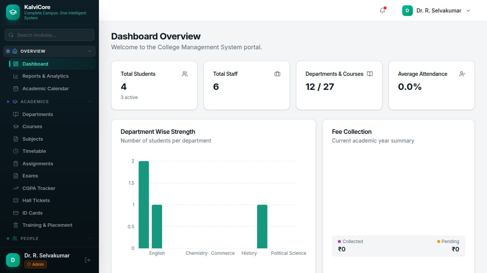

The Dashboard Overview provides a real-time snapshot of the institution's key metrics:

- **Summary Cards:** Total Students, Total Staff, Departments & Courses count, and Average Attendance percentage displayed in clean stat cards with icons
- **Department Wise Strength:** Bar chart showing student distribution across departments (English, Chemistry, Commerce, History, Political Science, etc.)
- **Fee Collection:** Pie chart showing Collected vs Pending fees with amounts in Indian Rupees
- **Sidebar Navigation:** Collapsible sidebar with categorized modules under Overview, Academics, and People sections
- **User Profile:** Logged-in user name and role displayed in the top-right corner with notification bell
- **Search:** Module search bar in the sidebar for quick navigation

---

## 3. Departments

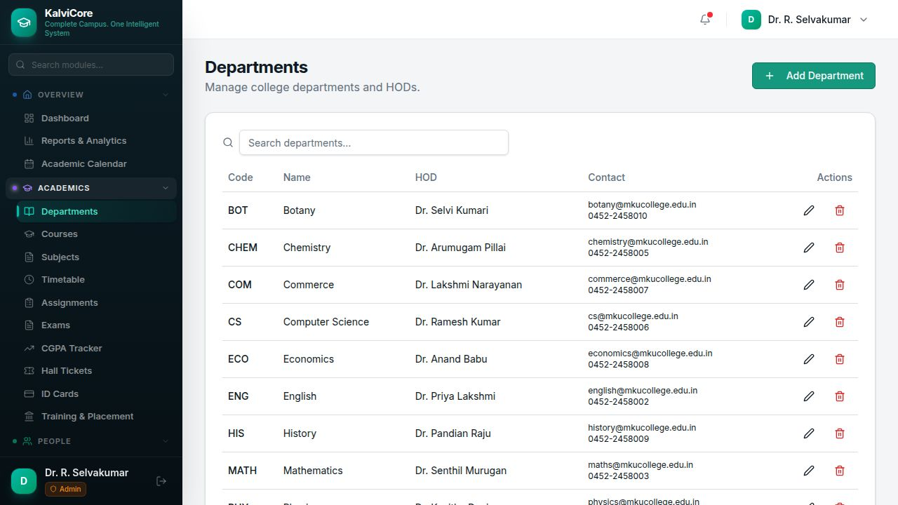

Manage all college departments with complete CRUD operations:

- **Department listing:** Table with Code, Name, HOD (Head of Department), Contact email and phone
- **Search:** Filter departments by name or code
- **Actions:** Edit and Delete buttons for each department
- **Add Department:** Button to create new departments
- **Pre-loaded data:** 12 departments including Botany, Chemistry, Commerce, Computer Science, Economics, English, History, Mathematics, Physics, Political Science, Tamil, and Zoology
- **HOD Assignment:** Each department shows the assigned Head of Department

---

## 4. Students

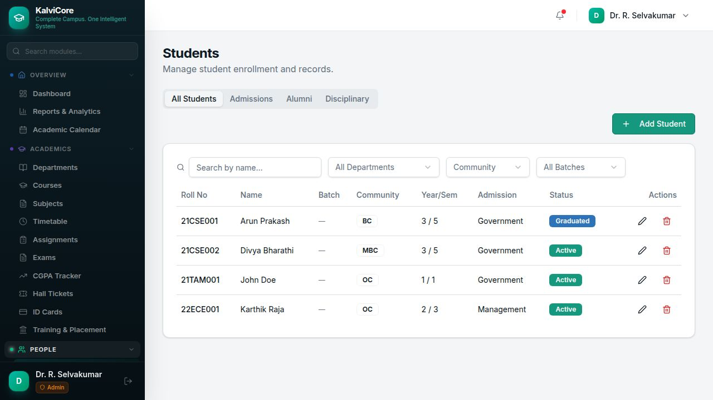

Comprehensive student management with multiple views:

- **Tab Navigation:** All Students, Admissions, Alumni, and Disciplinary tabs
- **Student Table:** Roll No, Name, Batch, Community (BC, MBC, OC), Year/Semester, Admission Type (Government/Management), and Status (Active/Graduated)
- **Filters:** Search by name, filter by Department, Community, and Batch
- **Status Badges:** Color-coded status indicators - green for Active, teal for Graduated
- **Actions:** Edit and Delete per student
- **Add Student:** Button to register new students with all required fields

---

## 5. Staff

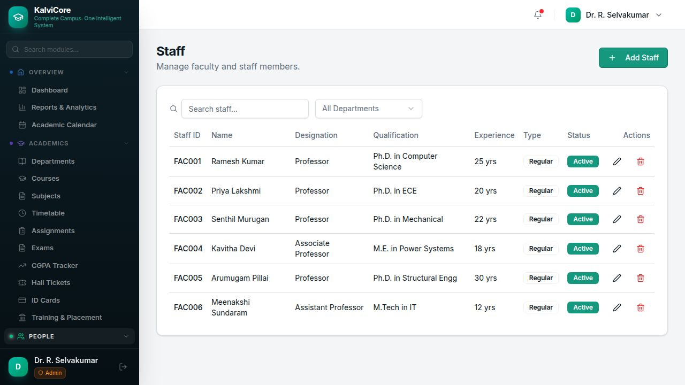

Faculty and staff management module:

- **Staff Table:** Staff ID, Name, Designation, Qualification, Experience (years), Type (Regular/Contract), and Status
- **Department Filter:** Filter staff by department
- **Search:** Search staff by name or ID
- **Designations:** Supports Professor, Associate Professor, Assistant Professor, and more
- **Qualifications:** Tracks Ph.D., M.E., M.Tech, and other academic qualifications
- **Status Tracking:** Active/Inactive status with color-coded badges
- **Add Staff:** Button to add new faculty or staff members

---

## 6. Courses

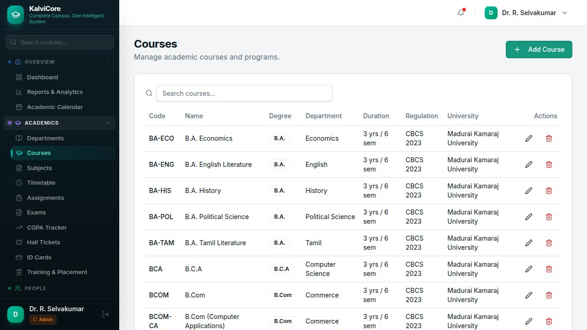

Academic course and program management:

- **Course Table:** Code, Name, Degree type (B.A., B.Com, B.C.A, B.Sc., M.A., M.Sc., M.Com), Department, Duration, Regulation, and University
- **Search:** Filter courses by name or code
- **Pre-loaded courses:** 27 courses including undergraduate and postgraduate programs
- **Course Details:** Duration shown as years/semesters, CBCS 2023 regulation, all affiliated to Madurai Kamaraj University
- **Add Course:** Create new academic programs

---

## 7. Subjects

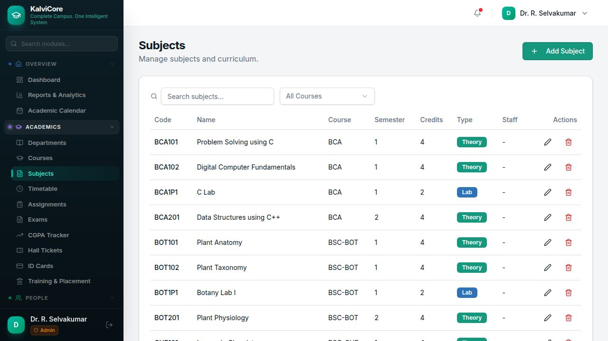

Curriculum and subject management:

- **Subject Table:** Code, Name, Course, Semester, Credits, Type (Theory/Lab), and Staff assignment
- **Course Filter:** Filter subjects by course
- **Search:** Search subjects by name or code
- **Type Badges:** Color-coded - teal for Theory, green for Lab
- **57 subjects pre-loaded:** Covering all courses and semesters
- **Add Subject:** Create new subjects with credit allocation

---

## 8. Attendance

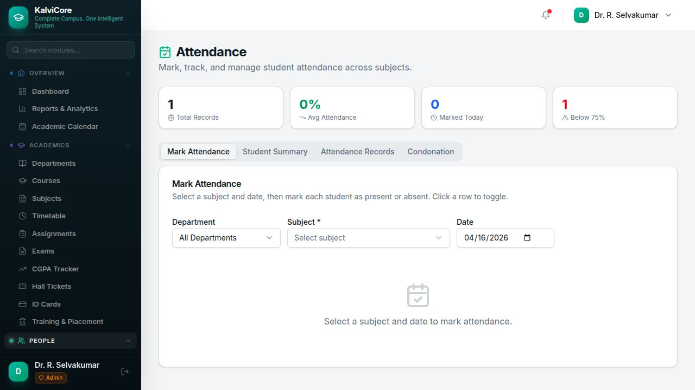

Complete attendance tracking and management system:

- **Dashboard Cards:** Total Records, Average Attendance %, Marked Today count, and Below 75% warning count
- **Tab Navigation:** Mark Attendance, Student Summary, Attendance Records, and Condonation
- **Mark Attendance:** Select Department, Subject, and Date to mark student attendance
- **Toggle System:** Click a row to toggle between Present and Absent
- **Condonation:** Handle attendance condonation requests for students below threshold
- **Date Picker:** Native date input for selecting attendance date

---

## 9. Fees & Payments

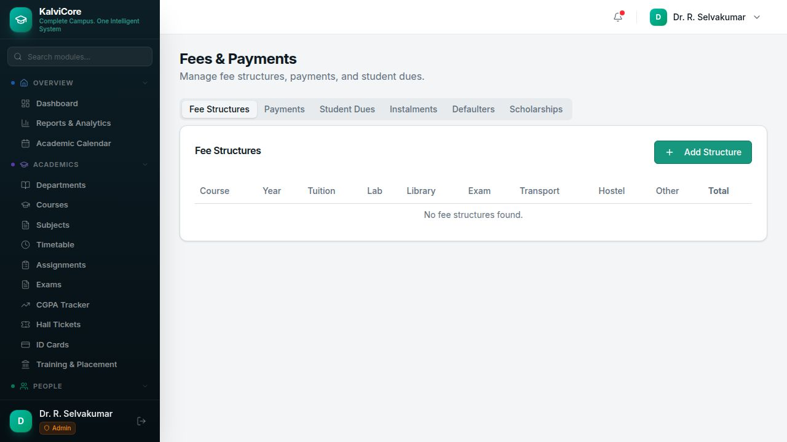

Comprehensive financial management:

- **Tab Navigation:** Fee Structures, Payments, Student Dues, Instalments, Defaulters, and Scholarships
- **Fee Structures:** Define course-wise fee breakdown - Tuition, Lab, Library, Exam, Transport, Hostel, and Other fees
- **Add Structure:** Create new fee structures per course and year
- **Payment Tracking:** Record and track individual payments
- **Instalment Plans:** Support for instalment-based fee payment
- **Defaulters:** Identify students with overdue payments
- **Scholarships:** Manage scholarship allocations and disbursements

---

## 10. Examinations

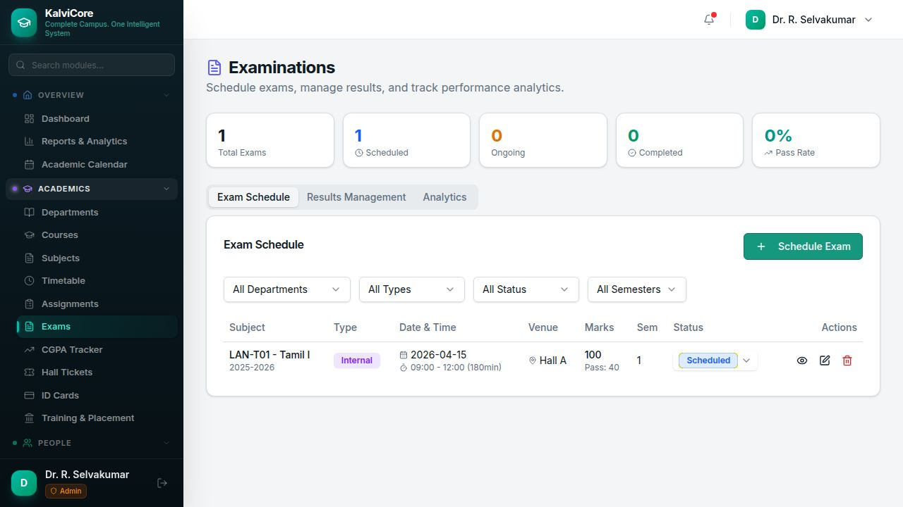

Exam scheduling, results, and analytics:

- **Dashboard Cards:** Total Exams, Scheduled, Ongoing, Completed counts, and Pass Rate percentage
- **Tab Navigation:** Exam Schedule, Results Management, and Analytics
- **Exam Table:** Subject, Type (Internal/External), Date & Time, Venue, Marks, Semester, and Status
- **Status Dropdown:** Change exam status (Scheduled, Ongoing, Completed, Cancelled)
- **Actions:** View, Edit, and Delete exams
- **Schedule Exam:** Create new exam entries with all details including venue, duration, and passing marks

---

## 11. Hostel Management

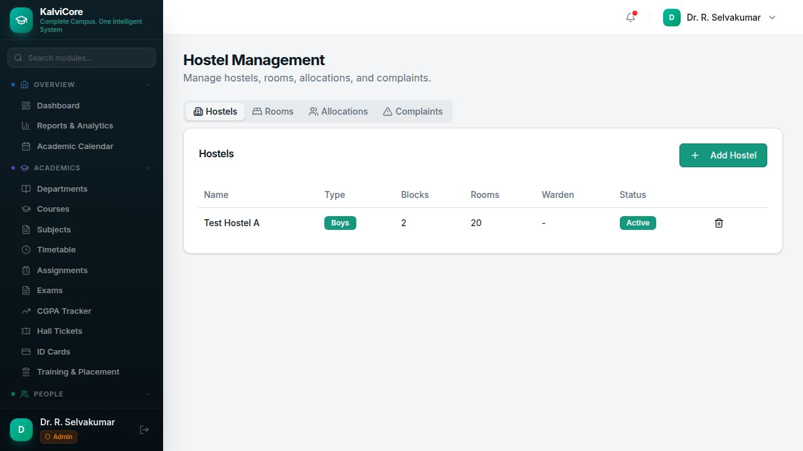

Manage campus hostels and student accommodation:

- **Tab Navigation:** Hostels, Rooms, Allocations, and Complaints
- **Hostel Table:** Name, Type (Boys/Girls), Blocks, Rooms count, Warden name, and Status
- **Type Badges:** Color-coded - blue for Boys, pink for Girls
- **Room Management:** Track individual rooms with capacity and occupancy
- **Allocations:** Assign students to specific hostel rooms
- **Complaints:** Handle hostel-related complaints and maintenance requests

---

## 12. Transport Management

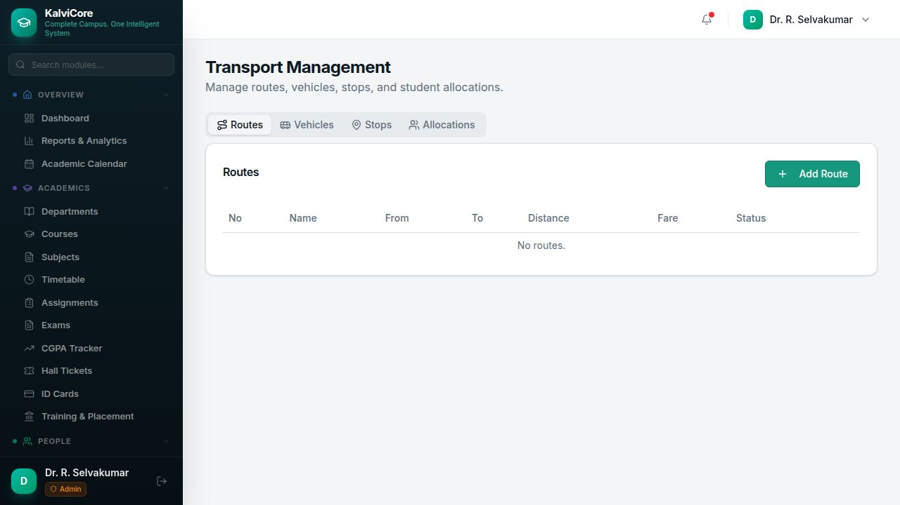

College transport route and vehicle management:

- **Tab Navigation:** Routes, Vehicles, Stops, and Allocations
- **Route Table:** Route number, Name, From, To, Distance, Fare, and Status
- **Vehicle Management:** Track bus/vehicle details and capacity
- **Stop Management:** Define pickup/drop points along routes
- **Student Allocations:** Assign students to transport routes
- **Add Route:** Create new transport routes with pricing

---

## 13. Library Management

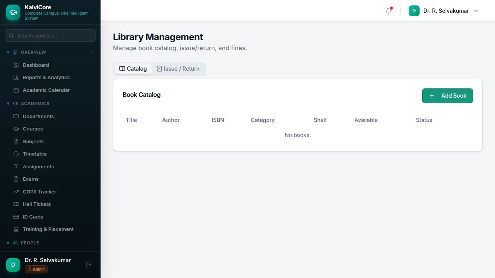

Digital library catalog and circulation system:

- **Tab Navigation:** Catalog and Issue/Return
- **Book Catalog:** Title, Author, ISBN, Category, Shelf location, Available copies, and Status
- **Add Book:** Register new books in the catalog
- **Issue/Return:** Track book borrowing and return operations
- **Availability Tracking:** Real-time count of available copies

---

## 14. Events & Cultural

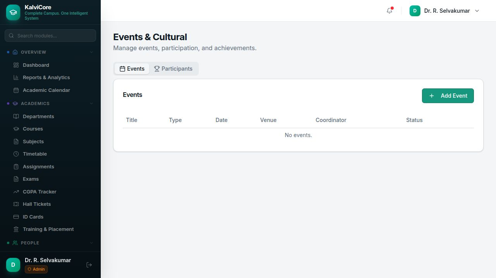

Campus event management and tracking:

- **Tab Navigation:** Events and Participants
- **Event Table:** Title, Type, Date, Venue, Coordinator, and Status
- **Add Event:** Create new events with all details
- **Participant Management:** Track student participation in events
- **Event Types:** Academic, Cultural, Sports, and other event categories

---

## 15. Communications

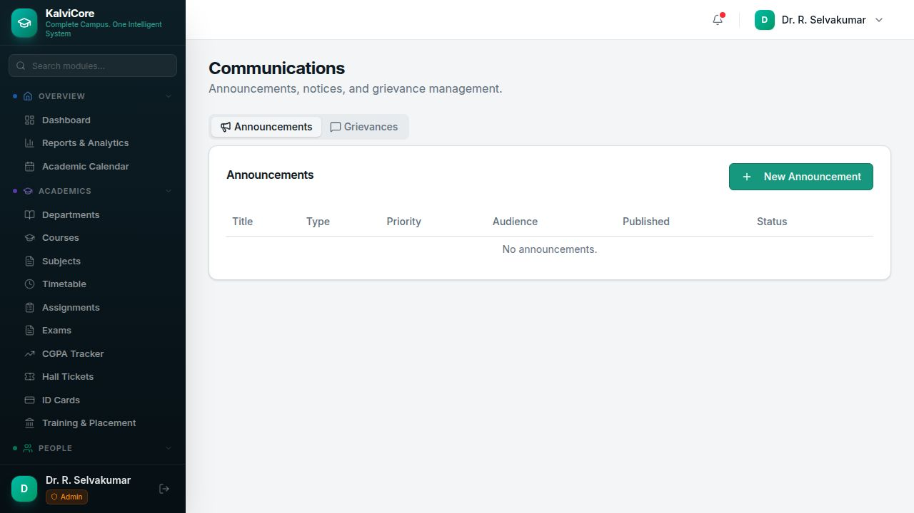

Announcements, notices, and grievance management:

- **Tab Navigation:** Announcements and Grievances
- **Announcement Table:** Title, Type, Priority, Audience, Published date, and Status
- **New Announcement:** Create announcements targeted at specific audiences
- **Grievance System:** Students and staff can raise grievances for resolution

---

## 16. Inventory & Assets

Institutional asset and inventory tracking:

- **Tab Navigation:** Assets and Store Items
- **Asset Table:** Tag, Name, Category, Location, Condition, and Status
- **Add Asset:** Register new institutional assets
- **Store Items:** Track consumable store items with stock levels
- **Condition Tracking:** Monitor asset condition (New, Good, Fair, Poor)

---

## 17. Timetable

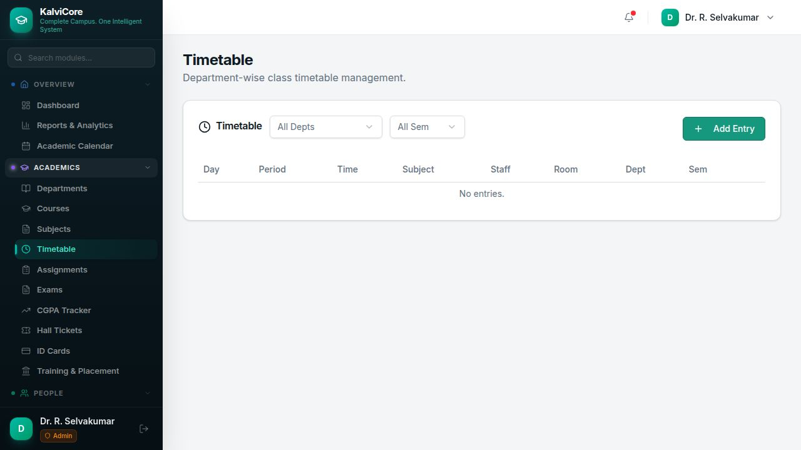

Department-wise class timetable management:

- **Filters:** Department and Semester dropdowns
- **Timetable Grid:** Day, Period, Time, Subject, Staff, Room, Department, and Semester
- **Add Entry:** Create new timetable entries
- **Conflict Detection:** Prevents scheduling conflicts for rooms and staff

---

## 18. Assignments

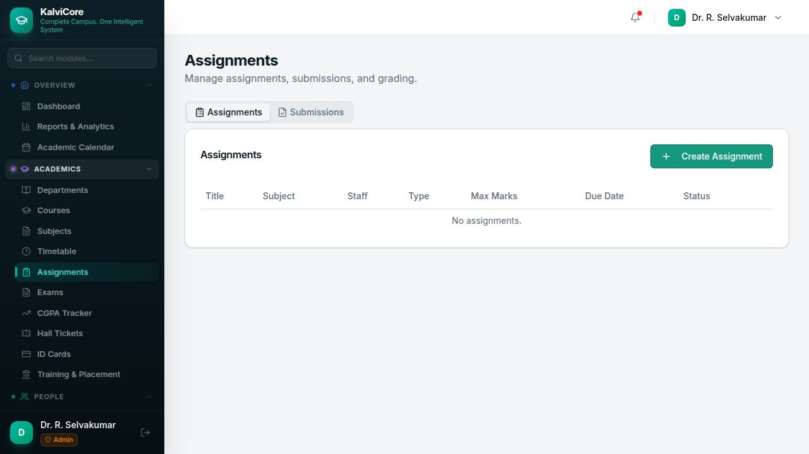

Assignment creation and submission tracking:

- **Tab Navigation:** Assignments and Submissions
- **Assignment Table:** Title, Subject, Staff, Type, Max Marks, Due Date, and Status
- **Create Assignment:** Create new assignments with deadline
- **Submission Tracking:** Track student submissions and grades

---

## 19. Certificates

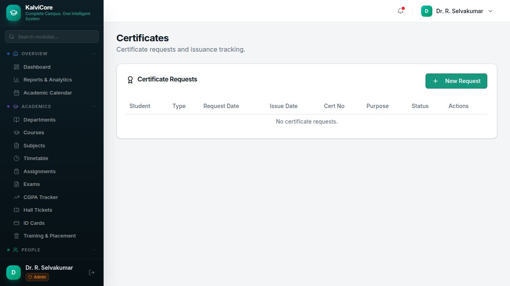

Certificate request and issuance management:

- **Certificate Requests Table:** Student, Type, Request Date, Issue Date, Certificate Number, Purpose, Status, and Actions
- **New Request:** Create certificate requests (Transfer, Bonafide, Character, Conduct, etc.)
- **Status Tracking:** Pending, Approved, Issued, Rejected status flow
- **Certificate Number:** Auto-generated unique certificate numbers

---

## 20. Staff Leaves

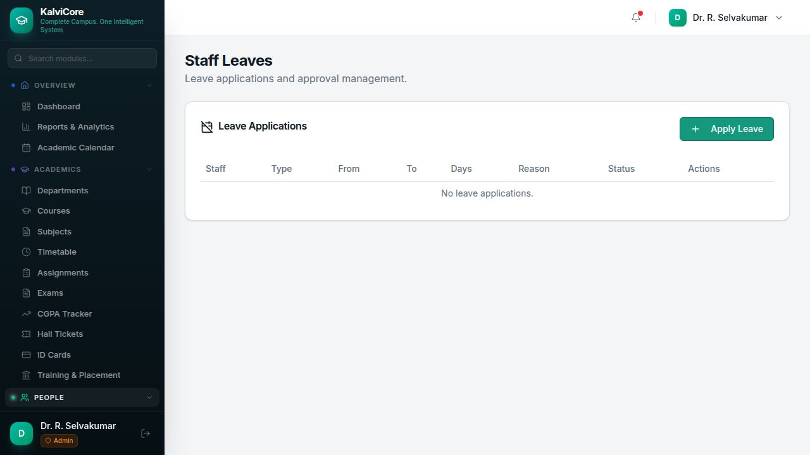

Leave application and approval workflow:

- **Leave Applications Table:** Staff, Type, From date, To date, Days, Reason, Status, and Actions
- **Apply Leave:** Submit leave applications with type and reason
- **Approval Workflow:** HOD/Principal approval chain
- **Leave Types:** Casual Leave, Sick Leave, Earned Leave, etc.

---

## 21. Settings & Configuration

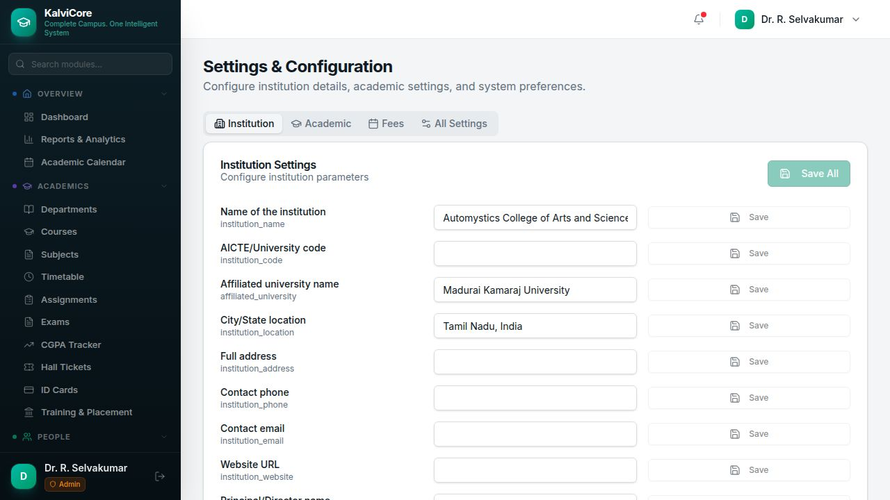

Centralized institution configuration:

- **Tab Navigation:** Institution, Academic, Fees, and All Settings
- **Institution Settings:** Name, AICTE/University code, Affiliated university, Location, Address, Phone, Email, Website, Principal/Director name
- **Individual Save:** Each setting can be saved independently
- **Save All:** Bulk save all settings at once
- **Pre-configured:** Institution name "Automystics College of Arts and Science", affiliated to Madurai Kamaraj University, Tamil Nadu

---

## 22. User Management

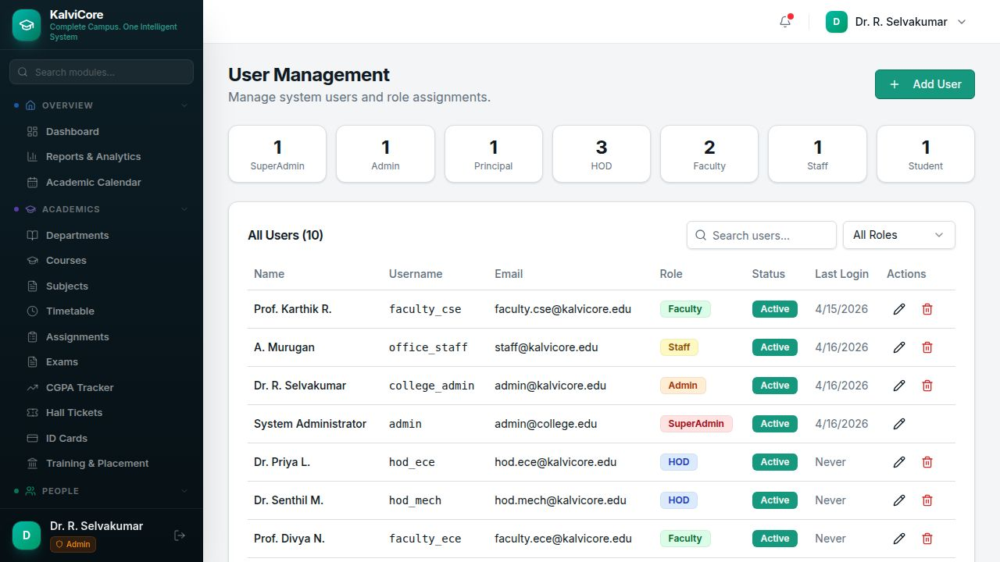

System user and role administration:

- **Role Distribution Cards:** Visual count of SuperAdmin, Admin, Principal, HOD, Faculty, Staff, and Student users
- **User Table:** Name, Username, Email, Role (color-coded badges), Status, Last Login, and Actions
- **10 pre-created users** across all roles
- **Search & Filter:** Search users and filter by role
- **Add User:** Create new users with role assignment
- **Role Badges:** Color-coded - orange for Admin, purple for SuperAdmin, blue for HOD, green for Faculty, amber for Staff

---

## 23. Reports & Analytics

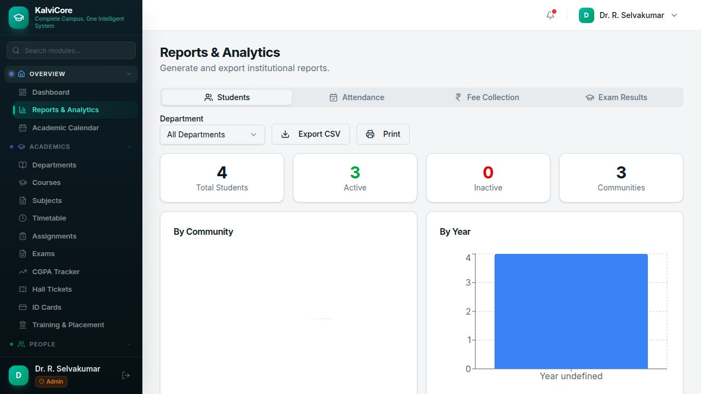

Comprehensive institutional reporting:

- **Report Tabs:** Students, Attendance, Fee Collection, and Exam Results
- **Department Filter:** Filter all reports by department
- **Export Options:** Export to CSV and Print buttons
- **Student Stats:** Total Students, Active, Inactive, and Communities count
- **Visualizations:** Bar charts for By Community and By Year distributions
- **Data-driven:** Real-time data pulled from all modules

---

## 24. Activity Log

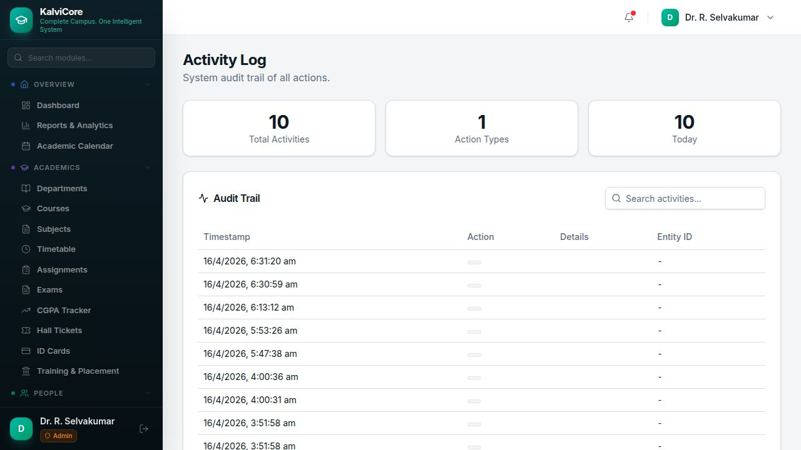

System audit trail for compliance and security:

- **Dashboard Cards:** Total Activities, Action Types, and Today's activity count
- **Audit Trail Table:** Timestamp, Action, Details, and Entity ID
- **Search:** Search activities by keyword
- **Chronological Log:** All system actions logged with timestamps
- **Complete Audit:** Tracks login, data changes, and system operations

---

## 25. Academic Calendar

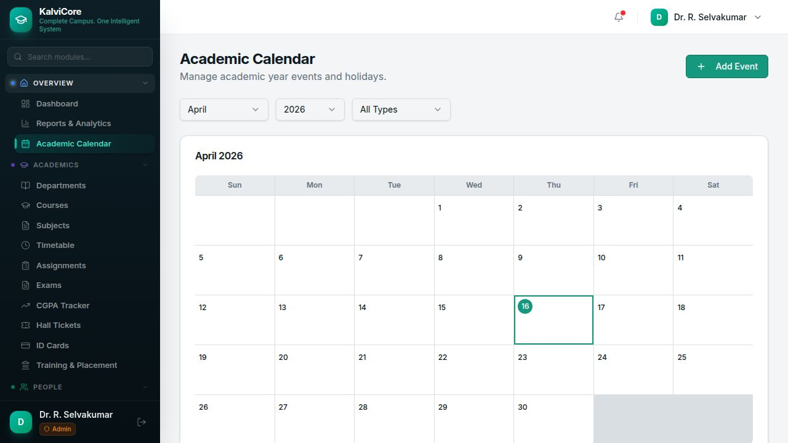

Visual academic year planning:

- **Calendar View:** Monthly grid layout showing current month (April 2026)
- **Month/Year Selector:** Navigate between months and years
- **Type Filter:** Filter events by type (Holiday, Exam, Event, etc.)
- **Today Highlight:** Current date highlighted in teal
- **Add Event:** Schedule new academic events, holidays, and important dates
- **Week View:** Sun-Sat layout with event indicators on specific dates

---

## 26. Payroll Management

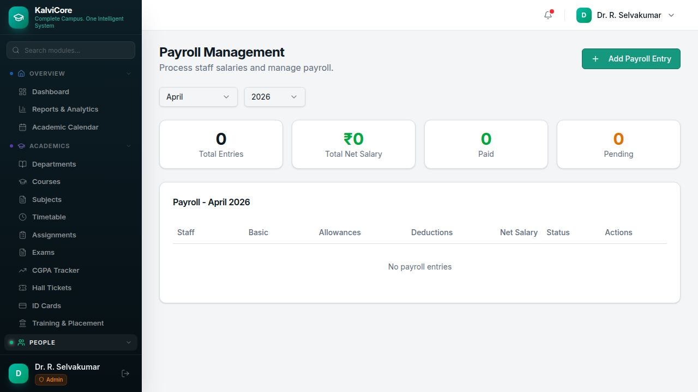

Staff salary processing and management:

- **Month/Year Selector:** Process payroll for specific months
- **Dashboard Cards:** Total Entries, Total Net Salary, Paid count, and Pending count
- **Payroll Table:** Staff, Basic salary, Allowances, Deductions, Net Salary, Status, and Actions
- **Add Payroll Entry:** Create individual payroll entries
- **Currency:** All amounts in Indian Rupees (INR)

---

## 27. CGPA Tracker

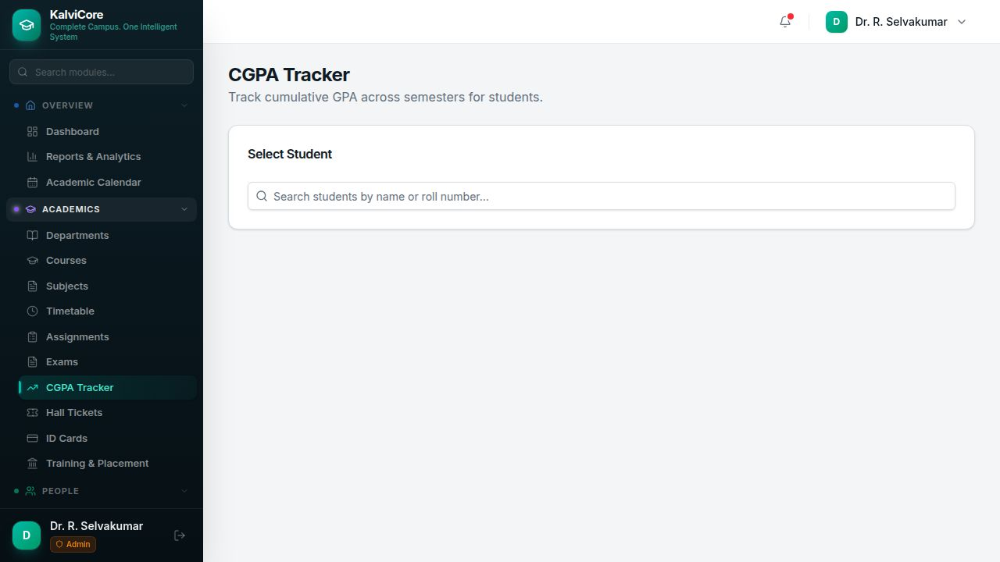

Cumulative GPA tracking across semesters:

- **Student Search:** Search by name or roll number
- **Semester-wise GPA:** Track GPA for each semester
- **CGPA Calculation:** Automatic cumulative GPA computation
- **Grade Point System:** Based on university grading standards

---

## 28. Bulk Import / Export

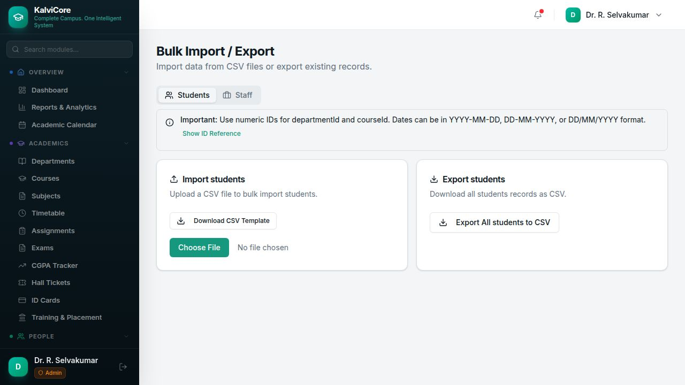

Mass data upload and download:

- **Tab Navigation:** Students and Staff
- **Import Section:** Upload CSV files for bulk student/staff import
- **Export Section:** Download all records as CSV
- **CSV Template:** Download pre-formatted template with correct headers
- **ID Reference:** Expandable section showing valid department and course IDs
- **Date Format Support:** Accepts YYYY-MM-DD, DD-MM-YYYY, and DD/MM/YYYY formats
- **Error Handling:** Detailed error messages for failed imports (duplicate entries, invalid IDs, null values)

---

## 29. Hall Tickets

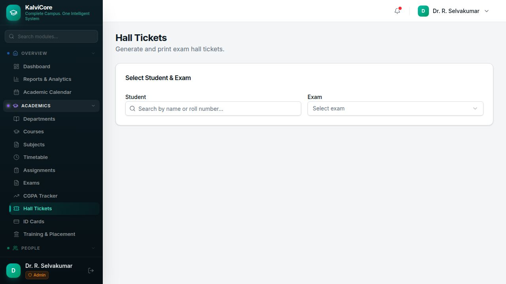

Exam hall ticket generation:

- **Student Search:** Search by name or roll number
- **Exam Selection:** Dropdown to select the target exam
- **Hall Ticket Preview:** Generated printable hall ticket with student details, exam schedule, and photo
- **Print Support:** Direct print functionality

---

## 30. Student Portal

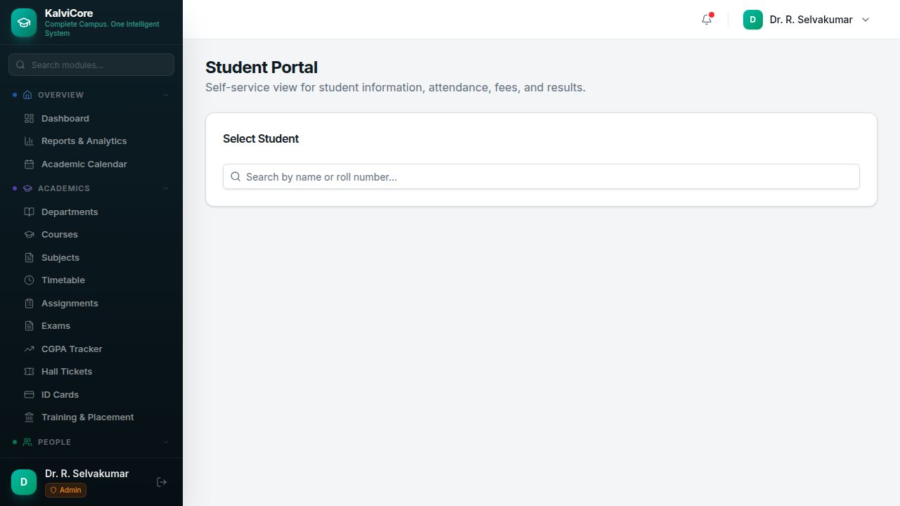

Self-service student information hub:

- **Student Search:** Search by name or roll number
- **Profile View:** Complete student profile with personal and academic details
- **Attendance Summary:** View individual attendance records
- **Fee Status:** Check fee payment status and dues
- **Results:** View exam results and grades

---

## 31. Data Backup & Restore

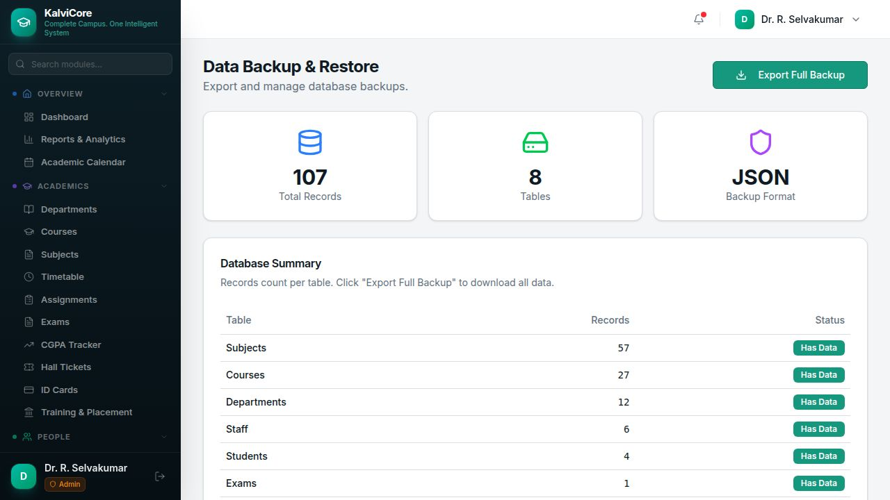

Database backup and management:

- **Dashboard Cards:** Total Records (107), Tables (8), and Backup Format (JSON)
- **Database Summary:** Per-table record count - Subjects (57), Courses (27), Departments (12), Staff (6), Students (4), Exams (1)
- **Status Badges:** "Has Data" indicators for populated tables
- **Export Full Backup:** Download complete database backup as JSON
- **Restore Capability:** Upload and restore from backup files

---

## 32. ID Cards

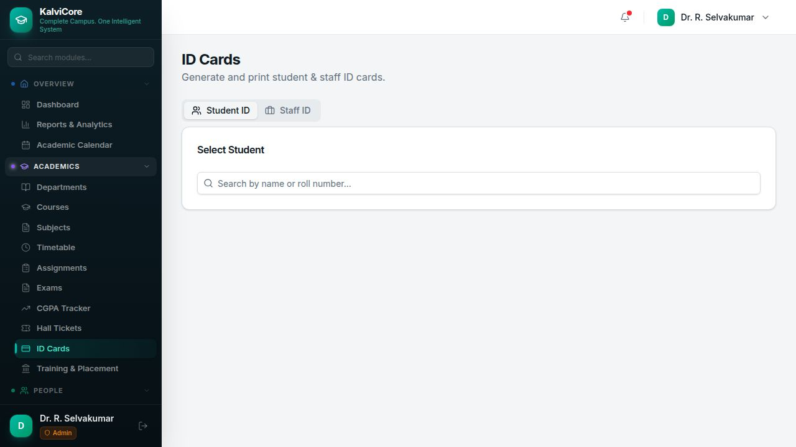

Student and staff ID card generation:

- **Tab Navigation:** Student ID and Staff ID
- **Student Search:** Search by name or roll number
- **ID Card Preview:** Professional ID card layout with photo, name, roll number, department, course, and validity
- **Print Support:** Direct print for ID card production

---

## 33. Notifications

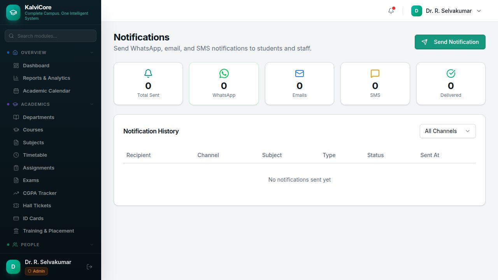

Multi-channel notification system:

- **Dashboard Cards:** Total Sent, WhatsApp, Emails, SMS counts, and Delivered count
- **Channel Icons:** Visual icons for each notification channel
- **Notification History:** Recipient, Channel, Subject, Type, Status, and Sent timestamp
- **Channel Filter:** Filter by All Channels, WhatsApp, Email, or SMS
- **Send Notification:** Create and send notifications to students and staff

---

## 34. Document Vault

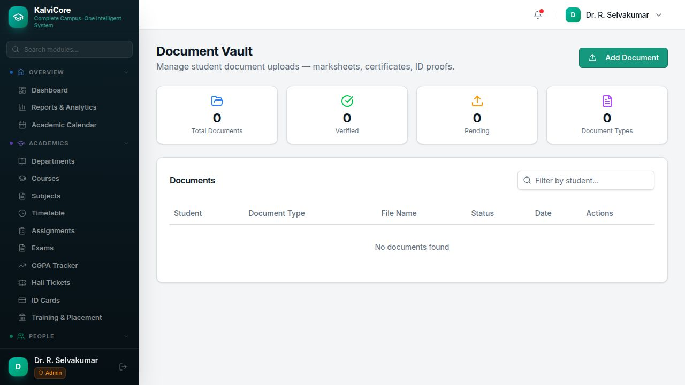

Student document upload and verification:

- **Dashboard Cards:** Total Documents, Verified, Pending, and Document Types count
- **Document Table:** Student, Document Type, File Name, Status, Date, and Actions
- **Add Document:** Upload marksheets, certificates, ID proofs, and other documents
- **Verification Workflow:** Pending/Verified status tracking
- **Filter:** Search documents by student name

---

## 35. Print Templates

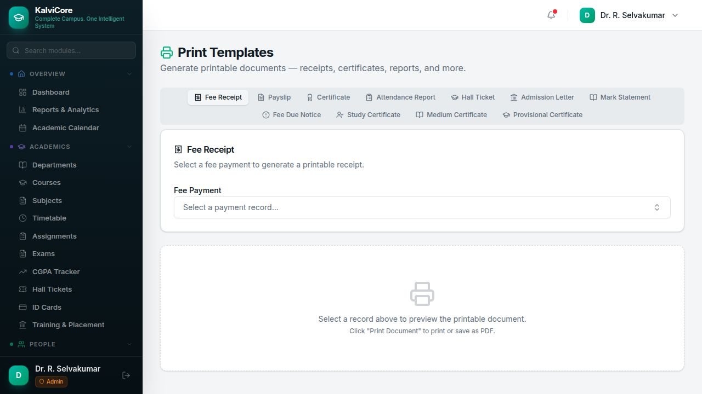

Printable document generation hub:

- **Template Tabs:** Fee Receipt, Payslip, Certificate, Attendance Report, Hall Ticket, Admission Letter, Mark Statement, Fee Due Notice, Study Certificate, Medium Certificate, and Provisional Certificate
- **Record Selection:** Searchable combobox to select the target record
- **Document Preview:** Live preview of the formatted document
- **Print Action:** Print or save as PDF functionality
- **11 Template Types:** Comprehensive coverage of all institutional documents

---

## 36. Parent Portal

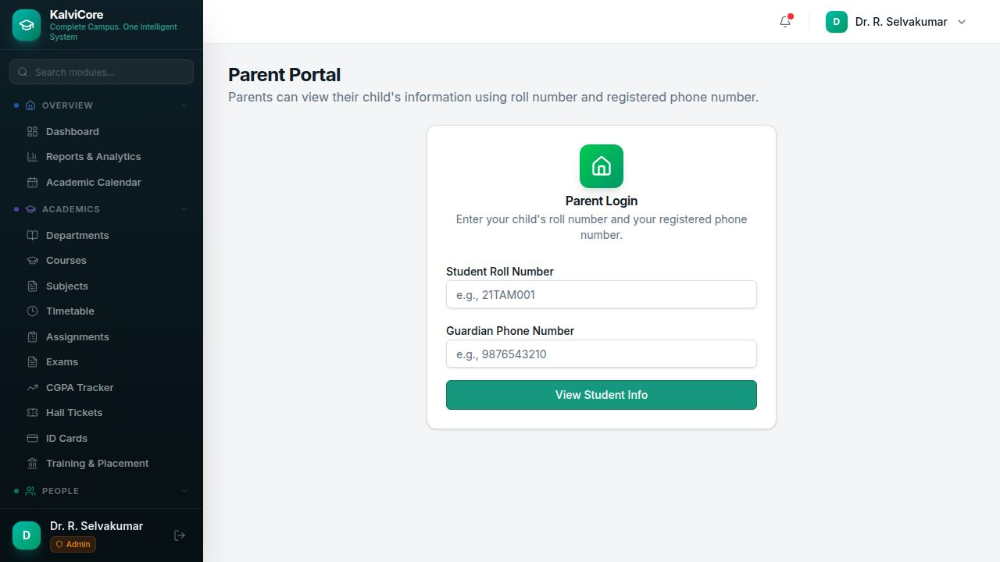

Parent access to student information:

- **Login Form:** Student Roll Number and Guardian Phone Number
- **Verification:** Matches roll number with registered guardian phone
- **Student Info View:** Shows child's attendance, fees, grades, and academic details
- **No Account Required:** Access via roll number and phone verification

---

## 37. Dashboard Customization

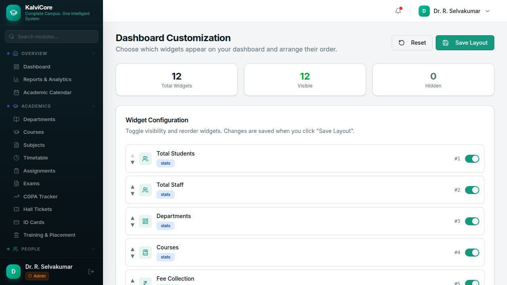

Personalize the dashboard layout:

- **Widget Summary:** Total Widgets (12), Visible (12), and Hidden (0) counts
- **Widget Configuration:** Toggle visibility and reorder dashboard widgets
- **Available Widgets:** Total Students, Total Staff, Departments, Courses, Fee Collection, Attendance, Department Strength chart, and more
- **Reorder Arrows:** Move widgets up/down to arrange dashboard layout
- **Save Layout / Reset:** Save custom configuration or reset to defaults

---

## 38. Training & Placement

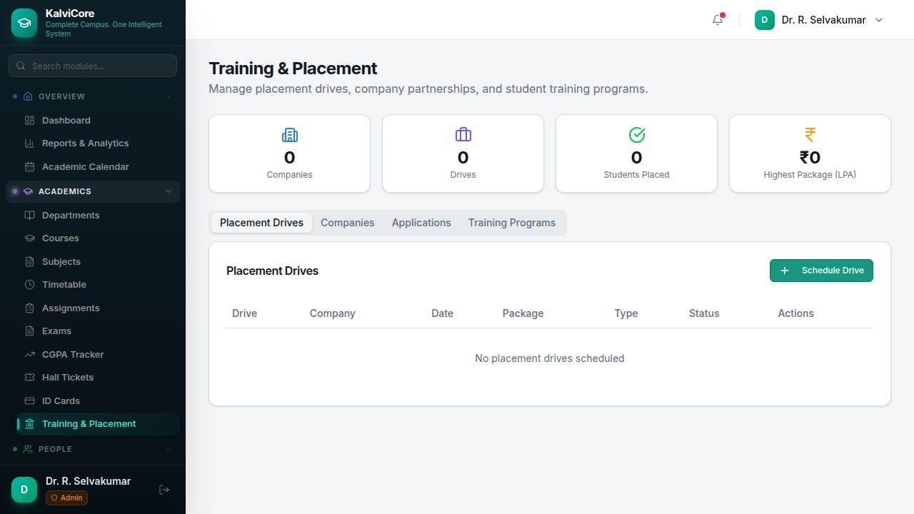

Campus placement and training management:

- **Dashboard Cards:** Companies, Drives, Students Placed count, and Highest Package (LPA)
- **Tab Navigation:** Placement Drives, Companies, Applications, and Training Programs
- **Placement Drives Table:** Drive name, Company, Date, Package, Type, Status, and Actions
- **Schedule Drive:** Create new placement drive entries
- **Company Management:** Track placement partner companies
- **Application Tracking:** Monitor student applications to placement drives

---

## 39. Fundraising & Donations

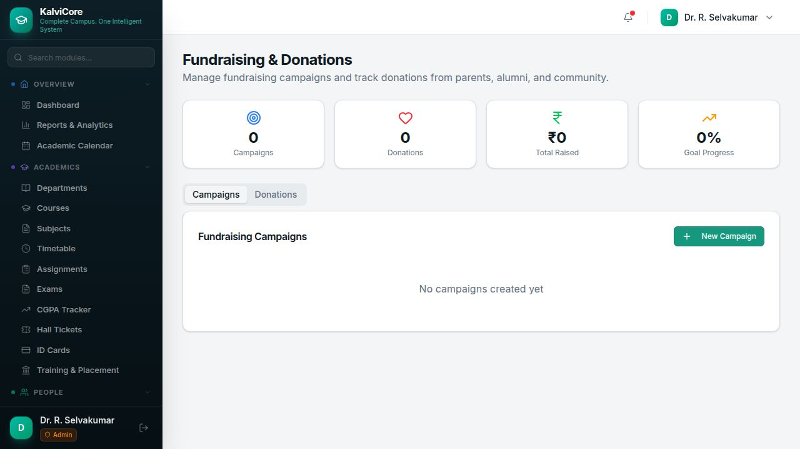

Institutional fundraising campaign management:

- **Dashboard Cards:** Campaigns, Donations, Total Raised (INR), and Goal Progress percentage
- **Tab Navigation:** Campaigns and Donations
- **Campaign Table:** Track fundraising campaigns with goals and progress
- **New Campaign:** Create fundraising campaigns targeted at parents, alumni, and community
- **Donation Tracking:** Record individual donations with donor details

---

## 40. Visitor Management

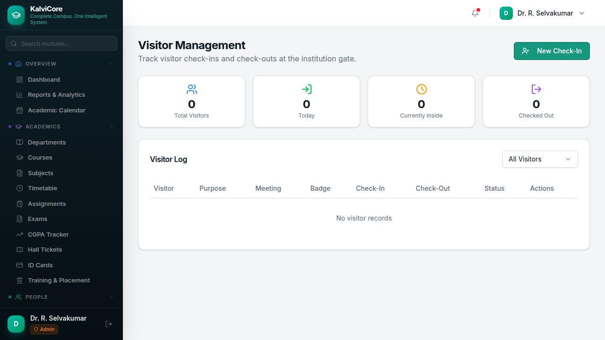

Gate and visitor tracking system:

- **Dashboard Cards:** Total Visitors, Today's visitors, Currently Inside, and Checked Out counts
- **Visitor Log Table:** Visitor name, Purpose, Meeting with, Badge number, Check-In time, Check-Out time, Status, and Actions
- **Filter:** Filter by All Visitors or specific status
- **New Check-In:** Register new visitor arrivals
- **Badge System:** Auto-generated visitor badge numbers

---

## 41. Access Management

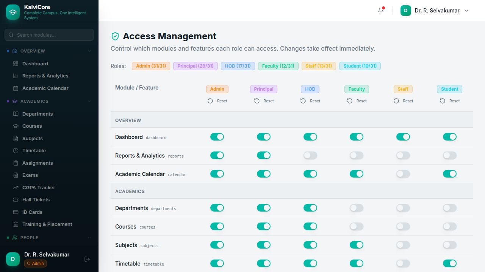

Granular role-based permission control:

- **Role Summary:** Admin (31/31), Principal (29/31), HOD (17/31), Faculty (12/31), Staff (13/31), Student (10/31) permissions
- **Permission Matrix:** Toggle switches for each module per role
- **Module Categories:** Overview, Academics, People, Finance, Campus, and Administration
- **31 Module Permissions:** Each of the 31+ modules can be independently toggled per role
- **Instant Effect:** Permission changes take effect immediately
- **Reset per Role:** Reset individual role permissions to defaults

---

## System Architecture

| Component | Technology |
|-----------|-----------|
| Frontend | React 18 + Vite + TypeScript |
| UI Library | ShadCN UI + Tailwind CSS |
| Backend | Express.js + Node.js |
| Database | PostgreSQL |
| ORM | Drizzle ORM |
| API | RESTful with OpenAPI specification |
| Authentication | JWT token-based with role permissions |
| Theme | Teal/Emerald enterprise palette |
| Deployment | Replit (Cloud) |

---

## Role-Based Access Summary

| Module | Admin | Principal | HOD | Faculty | Staff | Student |
|--------|:-----:|:---------:|:---:|:-------:|:-----:|:-------:|
| Dashboard | Yes | Yes | Yes | Yes | Yes | Yes |
| Departments | Yes | Yes | Yes | - | - | - |
| Students | Yes | Yes | Yes | Yes | Yes | - |
| Staff | Yes | Yes | - | - | - | - |
| Courses | Yes | Yes | Yes | - | - | - |
| Subjects | Yes | Yes | Yes | Yes | - | - |
| Attendance | Yes | Yes | Yes | Yes | - | - |
| Fees | Yes | Yes | - | - | Yes | - |
| Exams | Yes | Yes | Yes | Yes | - | - |
| Reports | Yes | Yes | - | - | - | - |
| Settings | Yes | - | - | - | - | - |
| Users | Yes | - | - | - | - | - |
| Access Mgmt | Yes | - | - | - | - | - |

---

*Document generated on April 16, 2026*  
*KalviCore v1.0 - AutoMystics*
